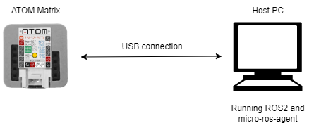

# micro-ROS Wrapper for ATOM Matrix

## Architecture



## Requirements

- [ATOM Matrix](https://docs.m5stack.com/en/core/atom_matrix)
- Host PC
  - [Ubuntu 20.04 LTS](https://releases.ubuntu.com/20.04/)
  - [ROS 2](https://docs.ros.org/en/humble/Installation.html)
  - See official page for supported versions; also available in Docker
- [PlatformIO IDE for VSCode](https://docs.platformio.org/en/latest/integration/ide/vscode.html)

## Quick Start

### Setup micro-ROS in the host PC

Install the micro-ROS build system on the host PC with ROS 2 installed:

```console
# Create a workspace and download the micro-ROS tools
mkdir microros_ws
cd microros_ws
git clone -b $ROS_DISTRO https://github.com/micro-ROS/micro_ros_setup.git src/micro_ros_setup

# Update dependencies using rosdep
sudo apt update && rosdep update
rosdep install --from-paths src --ignore-src -y

# Build micro-ROS tools and source them
colcon build
source install/local_setup.bash
```

To install the micro-ros Agent follow the steps below:

```console
# Download micro-ROS agent packages
ros2 run micro_ros_setup create_agent_ws.sh

# Build step
ros2 run micro_ros_setup build_agent.sh
source install/local_setup.bash
```

### Program the ATOM Matrix

Press the Upload button on PlatformIO to build and upload.

### Running micro-ROS agent in the host PC

Run the agent program:

```console
ros2 run micro_ros_agent micro_ros_agent serial --dev /dev/ttyUSB0 --baud 115200
```

In another terminal, verify that the topic is output:

```console
ros2 topic list
```

## Publish Topic

| Topic     | Type |
| :-------- | :--- |
| /imu/data | sensor_msgs/msg/Imu.msg |
